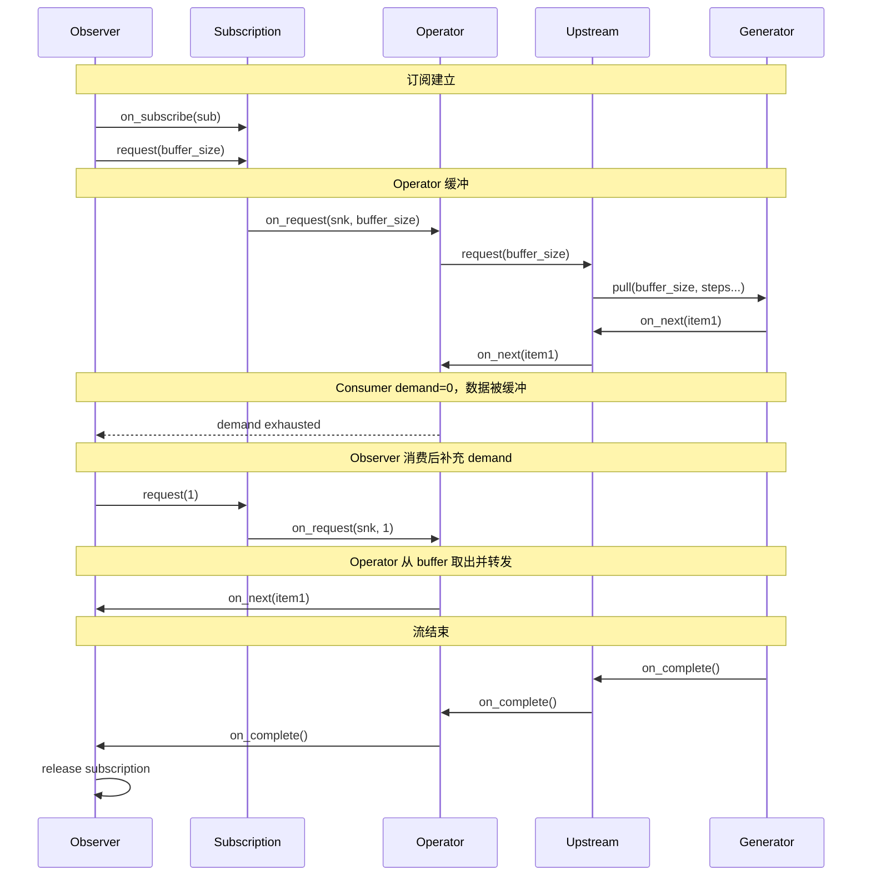
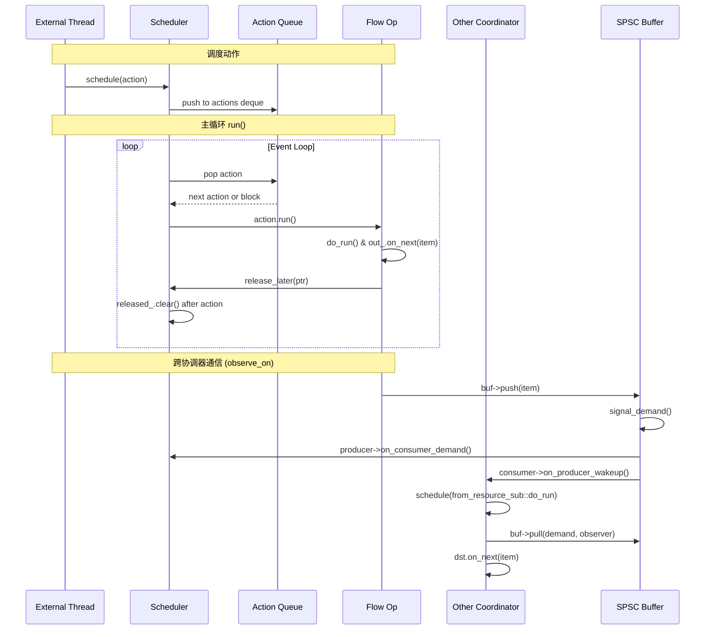
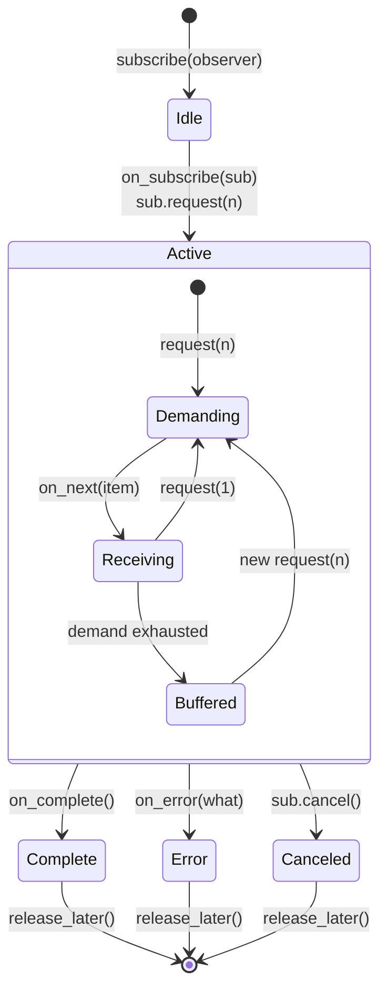
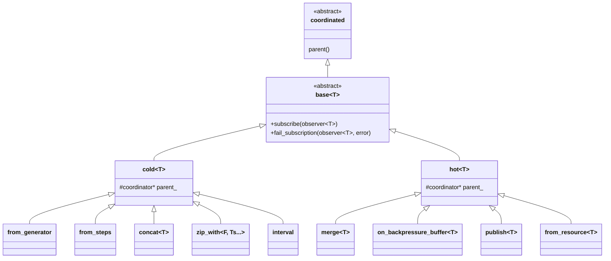

# CAF Flow (Reactive Streams) Subsystem Analysis

## Table of Contents

1. [Flow 整体架构](#1-flow-整体架构)
2. [与 Actor 模型的集成](#2-与-actor-模型的集成)
3. [异步支持](#3-异步支持)
4. [关键流程图](#4-关键流程图)

---

## 1. Flow 整体架构

CAF Flow 是一个完整的 Reactive Streams 实现，遵循 **Observable/Observer/Subscription** 三段式协议。所有文件位于 `libcaf_core/caf/flow/` 下。

### 1.1 核心协议类型

#### Observable<T> — 数据生产者

**文件:** `libcaf_core/caf/flow/observable_decl.hpp` (声明), `libcaf_core/caf/flow/observable.hpp` (实现)

`observable<T>` 是流式数据的生产者抽象，采用 **pimpl** (pointer-to-implementation) 模式：

```cpp
// observable_decl.hpp:30-38
template <class T>
class observable {
public:
  using output_type = T;
  using pimpl_type = intrusive_ptr<op::base<T>>;
  // ...
private:
  pimpl_type pimpl_;
};
```

它聚合了一个 `intrusive_ptr<op::base<T>>`，所有的类型擦除和多态行为都通过这个指针完成。`observable` 本身是轻量值类型（可拷贝、可移动）。

每个 `observable<T>` 的核心契约是 `subscribe(observer<T>)` (observable_decl.hpp:69)，这是数据流的起点。

#### Observer<T> — 数据消费者

**文件:** `libcaf_core/caf/flow/observer.hpp`

`observer<T>` 定义了对事件的三个响应方法，加上一个初始的订阅回执：

```cpp
// observer.hpp:33-49
class impl : public coordinated {
public:
  virtual void on_subscribe(subscription sub) = 0;   // 订阅建立时回调
  virtual void on_next(const T& item) = 0;            // 收到一个元素
  virtual void on_complete() = 0;                      // 流正常结束
  virtual void on_error(const error& what) = 0;       // 流异常结束
};
```

`observer` 句柄在调用 `on_complete()` 或 `on_error()` 后自动置空（通过 `release_later` 机制），确保一次性语义。

#### Subscription — 背压通道

**文件:** `libcaf_core/caf/flow/subscription.hpp`

`subscription` 是反向通道（observer -> observable），包含两个核心方法：

```cpp
// subscription.hpp:41-45
class impl : public coordinated {
public:
  virtual void cancel() = 0;          // 取消订阅
  virtual void request(size_t n) = 0; // 请求 n 个元素（背压信号）
};
```

关键设计：`subscription::fwd_impl` 在 producer (src) 和 consumer (snk) 之间建立连接：

```cpp
// subscription.hpp:86-116
class fwd_impl final : public impl_base {
public:
  fwd_impl(coordinator* parent, listener* src, coordinated* snk)
    : parent_(parent), src_(src, add_ref), snk_(snk, add_ref) {}
  void request(size_t n) override {
    src_->on_request(snk_, n);
  }
};
```

#### subscription::listener — 背压监听接口

`subscription::listener` (subscription.hpp:73-82) 是 observable operator 必须实现的接口，用于接收来自下游的 demand 信号：

```cpp
class listener : public coordinated {
public:
  virtual void on_request(coordinated* sink, size_t n) = 0;
  virtual void on_cancel(coordinated* sink) = 0;
  virtual void on_dispose(coordinated* sink) = 0;
};
```

### 1.2 背压 (Back-pressure) 机制

CAF Flow 实现的是 **request-based pull model**（基于请求的拉模式），与 Reactive Streams 规范一致。

#### 核心流程

1. **订阅建立时:** Observer 在 `on_subscribe` 中调用 `sub.request(n)` 表明初始需求
2. **数据流动:** Observable push 数据给 Observer，但 push 量受 Observer 的 demand 约束
3. **Demand 补充:** Observer 在 `on_next` 中可以隐式补充 demand（如 `default_observer_impl` 中自动 `sub_.request(1)`） (observer.hpp:249)
4. **零 demand 行为:** 当 demand 为 0 时，operator 必须缓冲或丢弃数据

#### 背压策略枚举

**文件:** `libcaf_core/caf/flow/backpressure_overflow_strategy.hpp`

```cpp
enum class backpressure_overflow_strategy {
  drop_newest,  // 丢弃最新到达的元素
  drop_oldest,  // 丢弃最旧的元素
  fail          // 产生 backpressure_overflow 错误
};
```

#### on_backpressure_buffer 操作符

**文件:** `libcaf_core/caf/flow/op/on_backpressure_buffer.hpp`

这是处理背压的核心中间件，作为 Hot Observable 在 Observable 和 Observer 之间插入一层带缓冲的适配器。设计要点：
- `buffer_` 是 `std::deque<T>`，兼顾前后插入删除
- 初始通过 `sub_.request(buffer_size_)` 从上游拉取足量数据 (line 65)
- `demand_` 跟踪下游 Observer 的实际处理能力
- 缓冲满时按策略：drop_newest 直接丢弃；drop_oldest 弹出队头；fail 立即终止

### 1.3 Observables 的冷热分类

CAF 明确区分 Cold 和 Hot Observable，分别对应两种基类：

**Cold Observable:** `op::cold<T>` (op/cold.hpp)
- 每个 subscriber 获得独立的数据流
- 在 `subscribe` 时才开始产生数据
- 例如：`from_container`, `from_generator`, `interval`, `concat`, `zip_with`

**Hot Observable:** `op::hot<T>` (op/hot.hpp)
- 所有 subscriber 共享同一数据流
- 数据可能在 subscribe 之前就开始产生
- 例如：`publish`, `from_resource`, `on_backpressure_buffer`, `merge`

### 1.4 操作符 (Operators)

CAF Flow 的操作符分为两大类：

#### 步骤式操作符 (Steps)

**文件:** `libcaf_core/caf/flow/step/` 目录

Steps 是轻量级的变换单元，遵循统一接口。所有 Step 都必须暴露这三个方法：
- `on_next(item, next, steps...)` -> 处理元素并传递给下一步，返回 bool 表示是否继续
- `on_complete(next, steps...)` -> 传递完成信号
- `on_error(what, next, steps...)` -> 传递错误信号

**已实现的 Step：**

| Step | 文件 | 功能 |
|------|------|------|
| `map` | step/map.hpp | 元素类型变换 |
| `filter` | step/filter.hpp | 按谓词过滤 |
| `take` | step/take.hpp | 取前 n 个元素 |
| `skip` | step/skip.hpp | 跳过前 n 个元素 |
| `take_last` | step/take_last.hpp | 取后 n 个元素 |
| `skip_last` | step/skip_last.hpp | 跳过后 n 个元素 |
| `take_while` | step/take_while.hpp | 按谓词持续取 |
| `element_at` | step/element_at.hpp | 取第 n 个元素 |
| `ignore_elements` | step/ignore_elements.hpp | 丢弃所有元素 |
| `reduce` | step/reduce.hpp | 规约为单值 |
| `scan` | step/scan.hpp | 累积扫描 |
| `distinct` | step/distinct.hpp | 去重 |
| `do_on_next` | step/do_on_next.hpp | 副作用：每个元素 |
| `do_on_error` | step/do_on_error.hpp | 副作用：错误 |
| `do_on_complete` | step/do_on_complete.hpp | 副作用：完成 |
| `do_finally` | step/do_finally.hpp | 副作用：终态 |
| `on_error_complete` | step/on_error_complete.hpp | 错误转完成 |
| `on_error_return` | step/on_error_return.hpp | 错误时返回指定值 |

Steps 的编译期组合通过 `observable_def` (observable.hpp:175-562) 实现。`observable_def` 是一个编译期 pipeline 构建器，累积 Materializer + Steps... 直到调用 `materialize()`。链式调用 `transform` 添加步骤，最终 `materialize` 熔合为一个 operator。Steps 通过编译期熔合，`map().filter().map()` 不会产生多个嵌套对象，而是产生单一的 `from_steps` operator，大幅减少虚函数开销。

#### 操作符型 Operators (op)

**文件:** `libcaf_core/caf/flow/op/` 目录

这些是更复杂的操作，每个都是 `op::base<T>` 的子类，实现独立的内部状态机。

**多源合并操作符：**

- **merge** (op/merge.hpp): 多路交插合并。维护 `input_map` (map<key, merge_input<T>>)，通过 round-robin 选择器平衡多个输入
- **concat** (op/concat.hpp): 串行拼接。在前一个 observable 完成后才订阅下一个，通过 key 比较丢弃过期 forwarder 的事件
- **zip_with** (op/zip_with.hpp): 按索引对齐组合。将多个 observable 的第 n 个元素组合成一个 tuple，所有输入都有元素才输出
- **combine_latest** (observable.hpp:925-943): 任意输入更新时，将所有输入的最新值组合

**时间相关操作符：**

- **interval** (op/interval.hpp): 按时间间隔发射递增整数
- **debounce** (op/debounce.hpp): 在一段静默期后发射最新值
- **sample** (op/sample.hpp): 按时间间隔采样最新值
- **throttle_first** (op/throttle_first.hpp): 按时间间隔节流，取第一个

**多播操作符：**

- **publish** (op/publish.hpp): 将 cold observable 转为 connectable，允许多个 subscriber
- **mcast** (op/mcast.hpp): publish 的底层多播基础设施
- **ref_count** (op/ref_count.hpp): 自动连接/断开
- **auto_connect** (op/auto_connect.hpp): 达到指定 subscriber 数量后自动连接

**容错操作符：**

- **retry** (op/retry.hpp): 按谓词条件重试
- **on_error_resume_next** (op/on_error_resume_next.hpp): 错误时切换到备用 observable

**特殊操作符：**

- **buffer** (op/buffer.hpp): 按数量或时间窗口收集
- **cache** (op/cache.hpp): 缓存所有元素，后续订阅者重放
- **prefix_and_tail** (op/prefix_and_tail.hpp): 取前 n 个 + 剩余
- **defer** (op/defer.hpp): 延迟创建 observable

### 1.5 Generator 模式

**文件:** `libcaf_core/caf/flow/gen/` 目录

CAF 引入了 Generator 概念，通过 `pull()` 方法产生数据。Generator 被 `op::from_generator` 包装为 observable。

**已实现的 Generator:**

| Generator | 文件 | 功能 |
|-----------|------|------|
| `just<T>` | gen/just.hpp | 发射单个值 |
| `repeat<T>` | gen/repeat.hpp | 重复发射同一值 |
| `iota<T>` | gen/iota.hpp | 递增序列 |
| `empty<T>` | gen/empty.hpp | 立即完成 |
| `from_container<C>` | gen/from_container.hpp | 从容器发射 |
| `from_callable<F>` | gen/from_callable.hpp | 从可调用对象发射 |

`observable_builder` (observable_builder.hpp) 是工厂入口。

### 1.6 Steps 的编译期熔合机制

这是 CAF Flow 的关键性能优化。当用户写链式调用时，Steps 被累积到 `observable_def` 的 `std::tuple<Steps...>` 中，`materialize()` 时生成单一 `from_generator<Generator, Steps...>` 类。

`from_generator_sub::pull()` 在运行时通过 `std::apply` 解包 steps 元组，链式调用每个 step 的 `on_next`。Steps 的 `on_next` 返回值 `bool` 控制提前终止。

---

## 2. 与 Actor 模型的集成

### 2.1 Coordinator — Flow 的执行引擎

**文件:** `libcaf_core/caf/flow/coordinator.hpp`, `coordinator.cpp`

`coordinator` 继承自 `async::execution_context`，是所有 flow 组件的执行上下文。它提供时间调度、组件创建和生命周期管理。

所有 flow 组件（observable、observer、subscription）都继承自 `coordinated`：

```cpp
// coordinated.hpp:14-24
class CAF_CORE_EXPORT coordinated : public abstract_ref_counted {
public:
  virtual coordinator* parent() const noexcept = 0;
};
```

`coordinated` + `add_child` 模式确保了所有 flow 组件都与一个 coordinator 绑定，同一 coordinator 上的所有对象无需同步（单线程执行）。

### 2.2 ScopedCoordinator — 独立 Flow 运行环境

**文件:** `libcaf_core/caf/flow/scoped_coordinator.hpp`, `scoped_coordinator.cpp`

`scoped_coordinator` 是 `coordinator` 的独立实现，拥有自己的事件循环，**不依赖 Actor 系统**。

关键设计点：
- **`delay` 与 `schedule` 的区别**：`schedule` 立即入队并通知；`delay` 在当前 cycle 结束时执行
- **`delay_until`**：用 `std::multimap` 按时间点排序存储，在 `next()` 中检查到期
- **`release_later`**：将对象放入 `released_` 向量，每个 cycle 结束时统一清理

### 2.3 ScheduledActor 集成

当 Flow 运行在 Actor 上时：
- `schedule(action)` -> 将 action 放入 Actor 的 mailbox
- `delay(action)` -> 在当前 Actor 事件处理末尾执行
- `delay_until(time, action)` -> 由 Actor 的时间调度器管理
- `steady_time()` -> 返回 Actor 的时钟

### 2.4 observe_on — 跨协调器桥接

**文件:** `observable.hpp:1110-1117`

```cpp
observable<T> observable<T>::observe_on(coordinator* other,
                                        size_t buffer_size,
                                        size_t min_request_size) {
  auto [pull, push] = async::make_spsc_buffer_resource<T>(buffer_size, min_request_size);
  subscribe(push);
  return other->add_child_hdl(std::in_place_type<op::from_resource<T>>, std::move(pull));
}
```

这是 **跨 actor/coordinator** 传递 flow 的核心机制：通过 SPSC 无锁缓冲区在两个执行上下文之间桥接。

### 2.5 与 Actor Stream 的集成

通过 `to_stream()` 和 `to_typed_stream()` (observable.hpp:1137-1186)，Flow observable 可以转换为 Actor Stream。

---

## 3. 异步支持

### 3.1 async 模块核心抽象

**文件:** `libcaf_core/caf/async/`

#### execution_context (execution_context.hpp)

所有能调度 action 的执行环境的抽象基类。`coordinator` 直接继承自此类。

#### producer / consumer (producer.hpp, consumer.hpp)

线程安全的异步生产者/消费者接口，用于跨线程通信。

#### SPSC Buffer (spsc_buffer.hpp)

无锁单生产者单消费者缓冲区，是 async 通信的核心。

关键内部机制：
1. **`ready()`** (spsc_buffer.hpp:356-366): 当生产者和消费者都已就位时触发，互相通知后发送初始 demand
2. **`signal_demand()`** (spsc_buffer.hpp:368-383): 累积 demand，超过 `min_pull_size_` 或 producer 被 block 时才通知 producer
3. **`pull_unsafe()`** (spsc_buffer.hpp:310-353): 批量取出元素并通过 `dst.on_next()` 传递给消费者

#### Resource 模式

`consumer_resource<T>` 和 `producer_resource<T>` 封装了 SPSC buffer 的两端，采用 **first-open-wins** 语义。

#### Publisher (publisher.hpp)

`async::publisher<T>` 提供跨 coordinator 的异步发布/订阅接口。

### 3.2 Promise / Future 风格

- **`detail::async_cell<T>`**: 包含 `std::variant<none_t, T, error>` 存储结果 + 等待回调列表
- **`promise<T>`** (promise.hpp): 析构时自动设置 broken_promise 错误
- **`future<T>` / `bound_future<T>`** (future.hpp): 提供 `.then()` 接口
- **`op::cell<T>`**: 将 async::cell 适配为 flow observable，允许异步计算结果无缝接入 Flow pipeline

---

## 4. 关键流程图

### 4.1 Observable 数据流管道

```mermaid
flowchart LR
    subgraph Source["数据源 (Generator/Observable)"]
        GEN[from_container<br/>from_generator<br/>interval<br/>from_resource]
    end

    subgraph Steps["Steps 管道 (编译期熔合)"]
        step1[map<br/>step/map.hpp]
        step2[filter<br/>step/filter.hpp]
        step3[take<br/>step/take.hpp]
        stepN[...]
    end

    subgraph Operators["复杂 Operator"]
        MERGE[merge<br/>op/merge.hpp]
        CONCAT[concat<br/>op/concat.hpp]
        ZIP[zip_with<br/>op/zip_with.hpp]
        BUF[on_backpressure_buffer<br/>op/on_backpressure_buffer.hpp]
    end

    subgraph Observer["消费者"]
        OBS[observer&lt;T&gt;<br/>observer.hpp]
        CB[for_each / subscribe<br/>observable.hpp]
    end

    GEN -->|subscribe| step1
    step1 --> step2
    step2 --> step3
    step3 --> stepN
    stepN -->|observable&lt;T&gt;| Operators
    Operators -->|subscribe| OBS
    OBS -->|request(n)| BUF
    BUF -->|request(n)| MERGE
    MERGE -->|request(n)| GEN
```

### 4.2 背压信号传递



### 4.3 Flow Coordinator 与 Scheduler 的交互



### 4.4 订阅生命周期与内存管理



### 4.5 Observable 操作符层次结构



### 4.6 Steps 编译期熔合流程

```mermaid
flowchart TB
    subgraph UserCode["用户代码"]
        UC["make_observable().from_container(vec).map(f1).filter(pred).map(f2)"]
    end
    subgraph CompileTime["编译期"]
        UC1["generation_materializer&lt;from_container&lt;T&gt;&gt;"]
        UC2["observable_def + tuple{map&lt;F1&gt;}"]
        UC3["observable_def + tuple{map&lt;F1&gt;, filter&lt;Pred&gt;}"]
        UC4["observable_def + tuple{map&lt;F1&gt;, filter&lt;Pred&gt;, map&lt;F2&gt;}"]
    end
    subgraph Materialize["materialize()"]
        OP["from_generator&lt;from_container, map, filter, map&gt;<br/>单一 operator 类"]
    end
    subgraph Runtime["运行时"]
        SUB["from_generator_sub"]
        RUN["do_run() -> pull() -> gen.pull(n, step1, step2, step3, term)"]
    end
    UC --> UC1
    UC1 -->|.map| UC2
    UC2 -->|.filter| UC3
    UC3 -->|.map| UC4
    UC4 -->|.as_observable()| OP
    OP -->|subscribe| SUB
    SUB --> RUN
```

---

## 总结

CAF Flow 是一个**现代 C++ Reactive Streams 实现**，具有以下关键特性：

1. **完整的背压协议**：基于 request() 的拉模式，三种背压处理策略
2. **编译期 Steps 熔合**：轻量变换在编译期熔合为单一 operator，零额外虚函数开销
3. **冷热 Observable 分离**：`cold<T>` 独立流 / `hot<T>` 共享流
4. **与 Actor 系统深度集成**：coordinator 统一调度；SPSC buffer + observe_on 跨协调器
5. **多操作符完备集**：变换、组合、时间、多播、容错全覆盖
6. **层级式内存管理**：`coordinated` -> `release_later` 批量清理
7. **高并发异步通道**：SPSC 无锁缓冲区 + producer/consumer 回调 + actor mailbox
